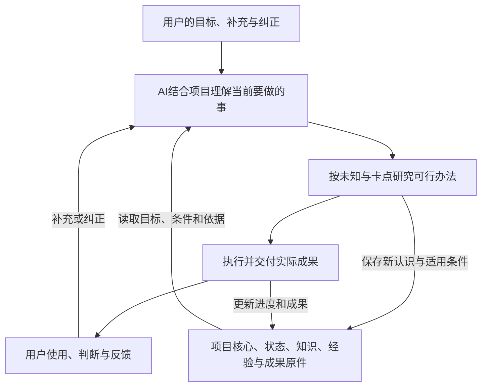

# AI Work System

把长期目标、当前任务、知识与经验保存为可读文件，让 AI 换聊天、换执行者后仍有依据继续工作。

AI Work System is a personal AI work system with file-backed goals, project continuity, knowledge recall, reusable experience, search tools, skills and host integrations. It publishes reusable source and instructions; users supply their own accounts, data and AI hosts.

## 整体怎样工作

这个项目来自长期使用 AI 处理实际事务时遇到的问题：补充被当成新目标，项目换聊天后丢失进度，经验保存了却没有被采用，做过的成果又被重复创建。核心思路是让有效目标、条件、知识和成果独立于某个聊天保存，再由当前 AI 联系本轮交办判断怎样继续。



代码负责确定性的存取、检索、版本更新与交接材料生成。理解含义、选择路线、调查外部材料及执行具体业务，由接入的 AI 和工具完成。目录、召回结果和状态声明都提供依据，实际效果仍取决于怎样采用它们。

## 本版提供什么

| 核心能力 | 对应实现 |
|---|---|
| 保存长期目的，按明确项目与分支接续 | `src/project-context.mjs`、`src/project-registry.mjs` |
| 目标和完成标准独立于进度更新，锁内合并并保留归档 | `src/shared-state.mjs` |
| 中文 Markdown 知识检索、完整卡读取与续读 | `src/knowledge.mjs` |
| SQLite FTS5 召回，可选本地向量及 RRF 融合 | `src/recall.mjs` |
| 经验记录、无效知识退役与恢复 | `src/knowledge-record.mjs`、`src/knowledge-lifecycle.mjs` |
| 保存对象类别、职责、条件及资源声明 | `src/object-access.mjs`、`src/resources.mjs` |
| 成果登记与生成接手材料 | `src/deliverables.mjs`、`handoff` 命令 |
| 多来源搜索发现、候选保存、原文与来源扩展 | `plugins/search-tools/`、`plugins/baidu-search-mcp/` |
| 社区文档、B站材料与网页读取工具 | `plugins/community-tools/`、`modules/search-integrations/` |
| 研究、知识复用、写作与协作方法 | `skills/` |
| 上下文注入、任务窗口、宿主角色及接续模板 | `integrations/` |
| 信息收集、对象资料、协作、运行、存储与成果展示 | `modules/system/` |

状态、上下文、知识检索、经验与成果模块从作者现用代码中提取并改为通用路径；工作区、对象/资源与命令入口为公开版适配。具体说明见 [代码来源与范围](docs/source-and-scope.md)。

本仓库公开作者自有的通用系统、搜索与其他插件、技能、宿主接入源码及空白模板。账号、个人知识、私人对话、实际业务数据由使用者自己提供；小说、销售和其他赚钱业务的专属实现不在本仓库内。

按用途选择入口：

| 你想使用什么 | 从哪里开始 |
|---|---|
| 先用项目、知识和接续核心 | [快速开始](docs/quickstart.md) |
| 单独用搜索、网页读取和社区工具 | [搜索插件](docs/search-plugins.md) |
| 给 AI 加入研究、知识与协作方法 | [技能与宿主接入](docs/skills-and-hosts.md) |
| 阅读和配置一般信息、运行与存储模块 | [通用系统源码](docs/general-system.md) |

这些模块保留现用实现，公开副本将个人路径与数据位置改为配置。它们有各自的依赖和入口，接入范围与实际运行条件见对应文档。

独立核心适合先使用文件接续；完整系统的对象、资料与召回入口在 `integrations/context/`，连接 `modules/system/` 的完整资料库。两类资料接口的格式和初始化方法见 [技能与宿主接入](docs/skills-and-hosts.md)，按所选入口建立自己的库。

## 开始使用

核心命令需要 Node.js 24 或更新版本，无必装的第三方 npm 依赖；默认检索在本地进行。向量召回可选，需要使用者自己提供已运行的 Ollama 和本地 embedding 模型。搜索插件和其它模块按各自文档安装 npm/Python 依赖，并配置使用者自己的服务。

下载仓库后，先创建你自己的工作区：

```powershell
git clone https://github.com/hdrtfhyrs/ai-work-system.git
cd ai-work-system
node bin/ai-work.mjs init --workspace ./workspace
node bin/ai-work.mjs project init --workspace ./workspace --name "资料整理工具" --goal "做一个能按主题整理资料并保留出处的工具"
node bin/ai-work.mjs projects --workspace ./workspace
```

接着，将 `workspace/AGENTS.md` 和所选项目的 `核心.md`、`共享状态.md` 告诉你正在使用的 AI。原生支持项目规则的工具可以读取该文件；其它宿主可在任务开头显式读取。

项目开始有分支后，用 `state update` 保存完整任务，再用 `context read` 或 `handoff` 取得接续正文。完整步骤见 [快速开始](docs/quickstart.md)。

如果工作区放在仓库之外，使用绝对路径，或设置 `AI_WORK_HOME`；每个入口使用同一工作区即可。初始化保留已有文件，不覆盖当前配置。代码不会安装开机/登录任务或常驻服务。

## 一次交办应该保留什么

项目核心保存最终结果。分支保存本轮完整任务、有效条件、完成标准、进度与依据。后续补充由 AI 联系这些原件理解：明确变更替换冲突内容，其余工作继续。做成的产物进入成果目录，接手者读取同一原件。

知识、经验和错误卡同时保留适用条件、实际结果、来源和限制。检索相似只是帮助定位，采用前仍需核条件。事实、动态状态、判断和未知分别保存；新证据可以修正旧做法。

详细原则见 [工作思想](docs/philosophy.md)，存储和模块关系见 [架构](docs/architecture.md)，宿主接入见 [接入现有 AI 工具](docs/integration.md)。

## 当前边界

这是从个人使用环境整理出的通用源码公开版本。核心提供统一文件命令；搜索、技能、钩子和系统模块提供各自入口。宿主自动注入、界面操作、云端调用与持续任务需要对应宿主、使用者配置和外部服务，不因代码已经公开就自动接通。没有将整个公开副本在所有环境重新运行，长期少返工要看真实任务。

`examples/` 中的条目是结构示例，均为虚构材料，不代表实际业务结果或验证过的经验。

## 许可与维护

本仓库自有代码和文档采用 [MIT 许可证](LICENSE)。署名使用作者公开账号 [hdrtfhyrs](https://github.com/hdrtfhyrs)。第三方软件、模型、插件及外部材料保留其各自许可，来源与依赖见 [第三方声明](THIRD_PARTY_NOTICES.md)。第三方安装包、模型权重和生产数据不随源码上传。

欢迎提供具体使用问题、可复现的故障信息和改进。协作方式见 [CONTRIBUTING.md](CONTRIBUTING.md)。
