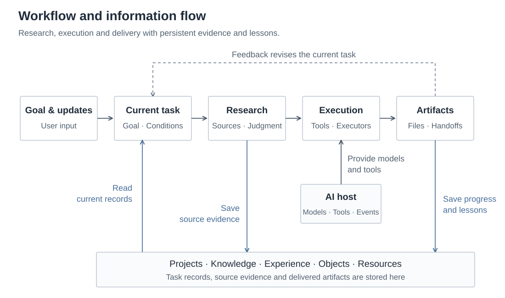

<p align="center"></p>

<p align="center"><b>English</b> · <a href="README.zh-CN.md">简体中文</a> · <a href="docs/en/quickstart.md">Quickstart</a> · <a href="docs/en/architecture.md">Architecture</a> · <a href="docs/en/search-plugins.md">Search plugins</a></p>

# Aimrail for Codex

**A project, research and tool layer for Codex. Work that can continue.**

Aimrail for Codex is an open extension layer built around a Codex-centered workflow. It connects complete tasks, source-based research, knowledge, resources, collaboration and delivered artifacts. Start with one project, then add search MCP tools, hybrid recall, host hooks, task windows, information collection and runtime modules as your work requires.

The core runs as a file-backed Node.js CLI. Codex hooks and skills connect it to daily work; Claude and Pi adapters are also included.

Its core contract is simple: **AI handles understanding and judgment; programs handle dependable storage; files retain the facts needed to continue.** The implementation connects goals to sources, tasks to execution, and artifacts to reusable knowledge.

[MIT](LICENSE) · Node.js 24+ · Node / Python / PowerShell · Files and SQLite · CLI / MCP / Host integrations

## Why this exists

Real work spans conversations, sources, models and executors. A user refines their intent. New evidence changes the plan. A saved lesson stops applying. When these changes live only in a chat history, the next session must reconstruct the work through repeated explanations and corrections.

This system stores the long-term objective, current complete task, applicable conditions, sources, actual progress and artifacts separately. The active AI reads these records alongside the new request. Executors can change while the work remains accessible. Research also informs task understanding: broaden what you know before choosing an approach.

## Capabilities

| Capability | Implemented mechanisms | Read the source |
|---|---|---|
| **Evolving intent and project continuity** | Separate project objectives and active branches; goals and criteria independent of progress; explicit session binding, context reconciliation and file handoffs | [Project context](src/project-context.mjs), [state](src/shared-state.mjs), [context management](modules/system/任务协作/context-manager/) |
| **Multi-source research** | Chinese and English search engines; GitHub/npm/MCP discovery; durable candidates, pagination, segmented source reading, link expansion and coverage status | [Search implementation](plugins/search-tools/), [source adapters](modules/search-integrations/) |
| **Knowledge and experience recall** | SQLite FTS5 trigram; optional Ollama embeddings; RRF fusion; source references, on-demand expansion, retirement and recovery | [Full-system recall](integrations/context/recall.mjs), [knowledge lifecycle](src/knowledge-lifecycle.mjs) |
| **Object and resource knowledge** | Categories, responsibilities, conditions, evidence and observed state; account entitlements recorded separately from actual capabilities | [Object knowledge](modules/system/资料中心/object-knowledge/), [resource registry](modules/system/资料中心/registry.mjs) |
| **Collaboration and recoverable execution** | Task windows, ownership and handoffs; locked updates; event deduplication, executor leases, checkpoints, retries and capability waiting | [Collaboration](modules/system/任务协作/), [event dispatch](modules/system/运行中心/event-dispatch.mjs) |
| **Information pipelines and artifact presentation** | Source collection, analysis queues and cloud-batch continuation; artifact registration, full-text/web presentation and explicit storage archiving | [Information center](modules/system/信息中心/), [artifact showcase](modules/system/成果展厅/), [storage](modules/system/存储接入/) |

## From a request to a continuing body of work



The host supplies models and tools. Skills guide research and execution. Hooks obtain relevant records at host events. State modules preserve concurrent updates and actual artifacts. Follow references when deeper context is needed, instead of placing the entire history into every prompt.

## The mechanisms behind the simple contract

### Task state: progress does not overwrite the objective

Markdown is the task record, and a stable branch ID identifies the work. A state update acquires a file lock, rereads the current version, merges only the supplied fields, and saves through a temporary file and atomic replacement. Goals, criteria, conditions, completed work and next actions have distinct fields. Archived branches remain readable by their original IDs.

This lets “where the work is now” change independently of “what the work must accomplish,” with explicit records for session changes, context compaction and executor handoffs. [State implementation](src/shared-state.mjs) · [Continuity mechanisms](docs/en/integration.md)

### Research: a discovered lead can be followed to its source

Search stores the candidates actually returned by providers and their pagination progress. Display budgets limit the returned window; later calls can continue reading. Source extraction preserves the final URL, date provenance, coverage and fetch status. Forum originals, replies, video descriptions, comments and subtitles have separate reading paths. Restricted or dynamic sources can produce host-reading requests and accept the source text the host actually retrieved.

The tools and research skill support discovery, initial interpretation, deeper reading, revised understanding and continued execution. The model chooses the queries and decides how to use the evidence. [Search guide](docs/en/search-plugins.md) · [English research skill](i18n/en/skills/evidence-research/SKILL.md)

### Recall: lexical ranking, semantic candidates and original records

FTS5 trigram supplies local lexical search, with optional embeddings for semantic candidates. Reciprocal Rank Fusion combines the two rankings. The implementation uses `k = 60`:

```text
RRF(d) = Σᵢ 1 / (60 + rankᵢ(d))
```

Results retain source references, locations and further-reading entry points. Similarity helps locate material; the active AI still checks whether its conditions apply. Invalid knowledge can be retired while its recovery material is retained. [Full-system recall](integrations/context/recall.mjs) · [Files and indexes](docs/en/architecture.md)

### Execution: state is more specific than “running”

Event dispatch uses a persistent queue and stable event keys. Executors acquire expiring leases. Result writes validate the lease, preventing an expired executor from overwriting a newer result. Failures enter retry, capability-waiting or terminal states; checkpoints and artifact references travel with the job. Handoffs carry the complete objective, conditions, evidence and outstanding work.

The reusable implementation provides these mechanisms; the user configures the models, accounts and continuing runtime. [Dispatch implementation](modules/system/运行中心/event-dispatch.mjs) · [Task handoffs](modules/system/任务协作/handoff-files.mjs)

## Workflows you can build

| Workflow | How the pieces connect |
|---|---|
| Cross-session development and long projects | Save the project objective and branch conditions → read current context → execute → save artifacts and the next action → hand off to the next executor |
| Technical investigation and source research | Discover multiple sources → read key originals and failure conditions → form a sourced conclusion → retain the sources and applicable lessons |
| Personal knowledge and learning | Organize knowledge and object relationships → recall existing understanding → fill gaps in the current task → connect new understanding to its records and artifacts |
| Multiple executors | Assign independently deliverable work → specify ownership and dependencies → return original files and artifacts → integrate and finish |
| Information collection and runtime support | Configure sources and execution capabilities → retain batches and queues → process increments for the task → register and present useful results |

These are workflows supported by the modules; users supply their own inputs. This repository publishes general capabilities. Dedicated revenue-generating business implementations and private data are excluded.

## Start with one project

The core requires Node.js 24+ without installing the entire external tool stack first.

```powershell
git clone https://github.com/hdrtfhyrs/aimrail-for-codex.git
cd aimrail-for-codex
node bin/ai-work.mjs init --workspace ./workspace --language en
node bin/ai-work.mjs project init --workspace ./workspace --language en --name "Source Organizer" --goal "Organize material by topic and retain traceable sources"
node bin/ai-work.mjs projects --workspace ./workspace
```

Ask your AI to read `workspace/AGENTS.md`, the project's `核心.md` and `共享状态.md`. Then use `state update`, `context read` and `handoff` to save and obtain the task. Initialization preserves existing files. [Complete quickstart](docs/en/quickstart.md)

Add further capabilities by module:

| Entry point | Guide |
|---|---|
| CLI / stdio MCP search and community tools | [Search configuration and commands](docs/en/search-plugins.md) |
| Authored skills, host events, roles and context injection | [Skills and host integration](docs/en/skills-and-hosts.md) |
| Objects, resources, information, collaboration, runtime, storage and presentation | [System modules and configuration](docs/en/general-system.md) |
| English skills, templates and compatible protocol names | [Language guide](docs/en/languages.md) |

## Repository map and documentation

```text
src/                         Project, state, knowledge and file core
plugins/                     Search MCP and community-tool wrappers
modules/search-integrations/ GitHub, forum and Bilibili source readers
modules/system/              Information, resources, collaboration, runtime, storage, presentation
skills/                      Authored skills and local skill adaptations
integrations/                Hooks, roles, hosts and continuity templates
i18n/en/                     English skills, roles, templates and examples
workspace/                   User-private data (ignored by Git)
```

[Design principles](docs/en/philosophy.md) · [Architecture](docs/en/architecture.md) · [Source scope](docs/en/source-and-scope.md) · [Contributing](docs/en/contributing.md)

The independent core and full-system registries have their own interfaces. [Host integration](docs/en/skills-and-hosts.md) explains which entry point to initialize. Set `AI_WORK_HOME` to select the shared data root.

## Release scope

This release contains reusable implementations, public-path adaptations, blank configuration and fictional examples. External accounts, browsers, cloud hosting and models require the user's own environment. The complete public distribution has not been rerun on every platform. English instructions retain compatible protocol keys; some runtime messages and interface text remain in Chinese.

Authored code and documentation use [MIT](LICENSE), maintained under the public account [hdrtfhyrs](https://github.com/hdrtfhyrs). Third-party dependencies and official skills retain their original licenses; mixed skills publish only local additions. [Third-party notices](docs/en/third-party-notices.md)

Bring your use case, relevant source and actual problem to the project: [Issues](https://github.com/hdrtfhyrs/aimrail-for-codex/issues) · [Contribution guide](docs/en/contributing.md).
