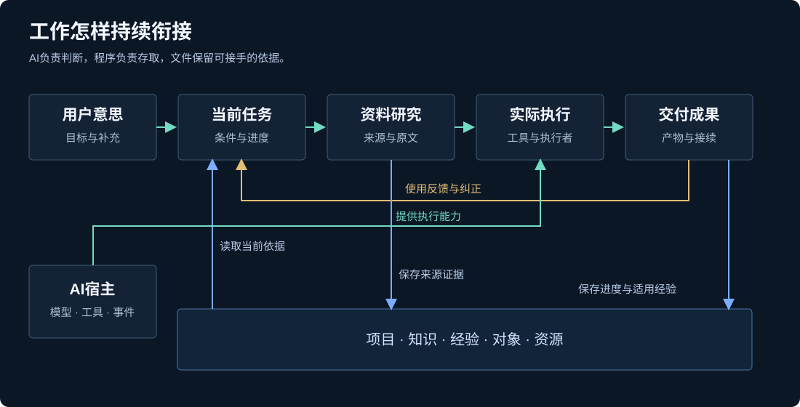

<p align="center"></p>

<p align="center"><a href="README.md">English</a> · <b>简体中文</b> · <a href="docs/quickstart.md">快速开始</a> · <a href="docs/architecture.md">架构</a> · <a href="docs/search-plugins.md">搜索插件</a></p>

# Aimrail for Codex

**为 Codex 接上项目接续、资料研究和工具扩展。**

Aimrail for Codex 是围绕 Codex 日常工作搭建的开源扩展层，将完整任务、搜索研究、知识经验、对象资源、协作执行和成果交付接到同一个持续工作过程。你可以从一个项目开始，也可以按需接入搜索 MCP、知识召回、宿主钩子、任务窗口、信息采集和运行模块。

核心是保存到文件的 Node.js CLI，Codex 钩子和技能将它接入日常工作；仓库也保留 Claude 与 Pi 的适配入口。

核心约定很简单：**AI 负责理解与判断，程序负责可靠存取，文件保留可以接手的事实。** 围绕这份约定，系统提供从目标到资料、从任务到执行、从产物到经验的具体实现。

[MIT](LICENSE) · Node.js 24+ · Node / Python / PowerShell · 文件与 SQLite · CLI / MCP / 宿主适配

## 为什么做这套系统

真正的工作往往跨越多个聊天、来源、模型和执行者。用户会继续补充意思，新的资料会改变方案，已保存的经验也可能不再适用。把这些变化只留在聊天记录里，后续工作就需要反复解释、寻找和纠正。

这里把长期目的、当前完整任务、适用条件、来源、实际进度和产物分别保存。当前 AI 读取同一套依据，联系新的交办继续判断；执行者可以更换，工作入口仍然可读。研究也参与理解任务：先扩大认识，再选办法，而不是只给既定路线寻找支持。

## 系统能力

| 能力 | 实际机制 | 从哪里读实现 |
|---|---|---|
| **累积意图与项目接续** | 长期核心与当前分支分开；目标、完成标准独立于普通进度；显式会话绑定、上下文融合与文件交接 | [项目核心](src/project-context.mjs)、[状态](src/shared-state.mjs)、[上下文管理](modules/system/任务协作/context-manager/) |
| **多来源研究** | 中文与英文引擎、GitHub/npm/MCP 目录；持久候选、分页接续、原文分段、来源扩展及覆盖状态 | [搜索实现](plugins/search-tools/)、[来源接入](modules/search-integrations/) |
| **知识与经验召回** | SQLite FTS5 trigram；可选 Ollama 向量；RRF 融合；原件引用与按需展开、退役和恢复 | [完整召回](integrations/context/recall.mjs)、[知识生命周期](src/knowledge-lifecycle.mjs) |
| **对象与资源认识** | 类别、职责、条件、证据和动态状态；资源、账号权益与实际能力分开记录 | [对象知识](modules/system/资料中心/object-knowledge/)、[资料库](modules/system/资料中心/registry.mjs) |
| **协作与可恢复执行** | 任务窗口、认领与交接；带锁更新；事件去重、执行租约、检查点、重试与能力等待 | [任务协作](modules/system/任务协作/)、[事件派发](modules/system/运行中心/event-dispatch.mjs) |
| **持续资料与成果呈现** | 来源采集、分析队列、云批次接续；产物登记、全文与网页展示、显式存储归档 | [信息中心](modules/system/信息中心/)、[成果展厅](modules/system/成果展厅/)、[存储](modules/system/存储接入/) |

## 从交办到成果的整体结构



宿主提供模型和工具，技能指导研究与执行，钩子按事件取得材料，状态模块保存并发更新和真实产物。需要深入时沿引用读源码和原件；不是把全部历史一次塞进提示词。

## 简单核心下面的具体机制

### 任务状态：目标不会被一句进度覆盖

Markdown 是任务原件，稳定分支 ID 定位当前工作。共享状态写入先取得文件锁，再读取最新版本，只合并调用方给出的字段，随后通过临时文件与原子替换保存。目标和标准、当前条件、已做和下一步各有位置，归档后仍能按原 ID 读取。

这让“已经做到哪里”和“最终要做到什么”可以分别更新，也为换聊天、压缩上下文和更换执行者提供清楚的接续依据。[状态实现](src/shared-state.mjs) · [接续机制](docs/integration.md)

### 研究链：发现线索之后，还能追到原文

搜索保存供应方实际返回的候选及分页进度，显示预算控制窗口，后续可以继续读取。原文提取保留最终 URL、日期来源、覆盖范围与获取状态；论坛主帖、回复、视频简介、评论和字幕分别处理。遇到动态页面或访问限制，可生成宿主读取待办，再接入实际取得的原文。

这些工具和研究技能一起支持“发现 → 初判 → 深读 → 修正认识 → 继续执行”，模型负责选择查询和采用证据。[搜索用法](docs/search-plugins.md) · [研究技能](skills/evidence-research/SKILL.md)

### 召回链：字面、语义与原件引用一起保留

FTS5 trigram 提供本地字面检索，可选 embedding 提供语义候选；两路名次用 Reciprocal Rank Fusion 合并。实现采用 `k = 60`：

```text
RRF(d) = Σᵢ 1 / (60 + rankᵢ(d))
```

返回值保留原件引用、位置和后续读取入口。资料相似只帮助找到线索，当前 AI 仍需核对条件；已失效的知识可以退役，并保留恢复材料。[完整系统召回](integrations/context/recall.mjs) · [文件与索引](docs/architecture.md)

### 执行链：工作状态比“正在运行”更具体

事件派发使用持久队列和稳定事件键，执行器取得有期限的租约。写回要验证租约，过期执行者不能覆盖新的结果；失败按状态进入重试、能力等待或终止，检查点与产物引用随任务保存。任务交接携带完整目标、条件、依据和未达项。

通用实现提供这些机制，具体模型、账号和持续运行条件由使用者配置。[事件实现](modules/system/运行中心/event-dispatch.mjs) · [任务交接](modules/system/任务协作/handoff-files.mjs)

## 可以怎样使用

| 场景 | 一次工作怎样接起来 |
|---|---|
| 跨聊天开发与长期项目 | 保存项目核心和分支条件 → 当前 AI 读取上下文 → 实际执行 → 保存产物和新的下一步 → 下一位执行者接手 |
| 技术选型与资料研究 | 多来源发现 → 阅读关键原文与失败条件 → 形成有出处的判断 → 保存来源和适用经验 |
| 个人知识与学习 | 整理知识和对象关系 → 召回已有认识 → 按当前任务补缺 → 将新的理解与实际成果接回原件 |
| 多执行者协作 | 分配可独立交付的任务 → 明确文件归属与依赖 → 汇回原件和产物 → 负责人整合收尾 |
| 信息采集与运行支持 | 配置来源和执行能力 → 保存批次及队列 → 按任务处理增量 → 登记可用结果并展示 |

这些是模块可以支持的工作方式；例子中的输入由使用者提供。仓库公开通用能力，赚钱业务的专属实现和私人数据不包含在内。

## 从一个项目开始

核心命令需要 Node.js 24+，无需先安装整套外部依赖。

```powershell
git clone https://github.com/hdrtfhyrs/aimrail-for-codex.git
cd aimrail-for-codex
node bin/ai-work.mjs init --workspace ./workspace --language zh-CN
node bin/ai-work.mjs project init --workspace ./workspace --language zh-CN --name "资料整理工具" --goal "按主题整理资料，并保留可回查的出处"
node bin/ai-work.mjs projects --workspace ./workspace
```

让正在使用的 AI 读取 `workspace/AGENTS.md`、项目的 `核心.md` 和 `共享状态.md`，再用 `state update`、`context read` 和 `handoff` 保存与取得任务。初始化保留已有文件。[完整快速开始](docs/quickstart.md)

需要更多能力时，按模块接入：

| 入口 | 文档 |
|---|---|
| CLI / stdio MCP 搜索和社区工具 | [搜索配置与命令](docs/search-plugins.md) |
| 自有技能、宿主事件、职责和上下文注入 | [技能与宿主接入](docs/skills-and-hosts.md) |
| 对象资料、信息、协作、运行、存储和展示 | [通用模块与配置](docs/general-system.md) |
| 英文文档、技能和项目模板 | [English edition](docs/en/languages.md) |

## 模块目录与文档

```text
src/                         项目、状态、知识与文件核心
plugins/                     搜索 MCP 与社区工具包装
modules/search-integrations/ GitHub、论坛和 B站来源读取
modules/system/              信息、资料、协作、运行、存储、展示
skills/                      自有技能与本地技能修订
integrations/                钩子、职责、宿主与接续模板
i18n/en/                     英文技能、职责、模板与示例
workspace/                   使用者的私有数据（Git 忽略）
```

[设计思想](docs/philosophy.md) · [架构](docs/architecture.md) · [源代码范围](docs/source-and-scope.md) · [参与维护](CONTRIBUTING.md)

独立核心和完整系统的资料库有各自的接口，选择与初始化方法在[宿主说明](docs/skills-and-hosts.md)中列出。公共数据根可用 `AI_WORK_HOME` 指定。

## 发布范围

本项目发布现用通用实现、公开路径适配、空白配置和虚构示例。外部账号、浏览器、云端托管和模型能力需要使用者自己的环境；本次公开版没有在所有平台重新运行整套系统。英文材料保留兼容的协议字段，运行时的部分文本仍为中文。

自有代码和文档采用 [MIT](LICENSE)，作者公开账号为 [hdrtfhyrs](https://github.com/hdrtfhyrs)。第三方依赖与官方技能保留原许可；混合技能只发布本地修订。[第三方声明](THIRD_PARTY_NOTICES.md)

欢迎带着具体用途、相关源码和实际问题参与改进：[提交问题](https://github.com/hdrtfhyrs/aimrail-for-codex/issues) · [贡献说明](CONTRIBUTING.md)。
