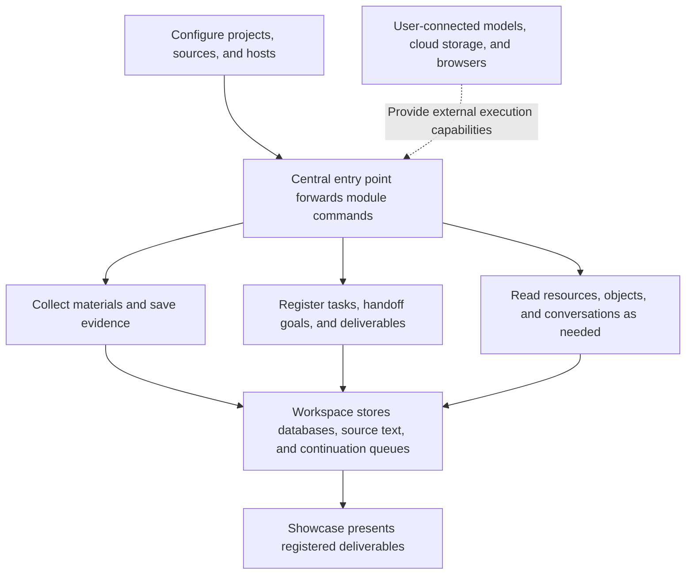

# General system source and entry points

[English home](../../README.md) · [中文](../general-system.md)

`modules/system` contains general implementations extracted from the AI work system in use: information collection and continuation, task handoff, resources and object knowledge, local conversation navigation, storage archiving, deliverable presentation, and read-only adapters that require a host browser. The public edition reorganizes paths and configuration while retaining source subdirectories so you can follow an entry point into its implementation. The release includes source and configuration examples. Extraction did not start services, invoke accounts, register schedules, or run tests, so the presence of source does not establish that these functions are running on your computer or in your cloud environment.



| Directory | Main source entry points | What it saves or returns |
| --- | --- | --- |
| `运行中心` — execution center | `system.mjs`, `module-registry.mjs`, `event-ingest.mjs`, `event-dispatch.mjs`, `event-pipeline.mjs` | Module directory, runtime observations, event queues, execution outputs, and failures; retains explicit routing, leases, and recovery implementations. |
| `信息中心` — information center | `app/main.py`, `app/task_collection.py`, `app/processor.py`, `app/publisher.py` | Source collection, original text, task-driven retrieval, analysis queues, and reports; model analysis needs a callable Codex supplied by the user. |
| `信息中心/cloud`, `接续接入` — continuation integration | `cloud/run_collect.py`, `cloud/run_native.py`, `接续接入/cloud-recovery.py`, `native-receive.py` | Single cloud-collection batches, chunks, and persistent continuation; the user configures remote hosting and local receipt. |
| `任务协作` — task collaboration | `handoff-files.mjs`, `task-bridge.mjs`, `task-window.mjs`, `context-manager/context-manager.mjs` | Complete goals, current branches, collaboration observations, task claims, and context fusion; calls the author-owned host code in `integrations/context` and `integrations/hooks`. |
| `资料中心` — resource center | `registry.mjs`, `handler.mjs`, `project-map.mjs`, `object-knowledge/objects.mjs` | Account and entitlement references, resource source records, project structure, object properties, and evidence; the public edition contains none of the author's registry data. |
| `本地统一` — local integration | `workspace.mjs`, `对话记录/conversations.mjs`, `运行环境/runtime.mjs` | On-demand reading of conversation source records, actual update times, and environment navigation; reading scope depends on user-configured host paths. |
| `本地统一/对话记录/action-manager`, `original-manager` | `action-manager.mjs`, `project-registry.mjs`, `app-client.mjs` | Project directory and native host UI integration; requires an actually available Codex app-server/bridge capability. |
| `存储接入`, `本地统一/文件归档` — storage integration and file archiving | `storage.py`, `cold_archive.py`, `google-drive.mjs`, `storage-health.mjs`, `lifecycle.py` | Explicit file snapshots, cloud-storage tool plans, precise cold archiving, and disk observations; no cleanup authorization list or cloud-storage account is provided by default. |
| `成果展厅` — deliverable showcase | `showcase.mjs`, `web/`, `screenshot.mjs` | Full text, images, and web pages for registered deliverables; the screenshot script requires your installed Edge/Chrome. |
| `浏览器接入` — browser integration | `boss-access.mjs`, `account-browser-access.mjs` | Page preparation, read-only observation, and security-verification diagnostics after a host browser API is injected; contains no browser backend, Cookies, or login data. |
| `工具接入/community-tools/src` — tool integration | `cli.mjs`, `bili-local.py`, `restore.ps1` | Community tool wrappers in the source directory; dependencies reuse the repository's `plugins/community-tools` installation location. |

The central search entry point forwards to `modules/search-integrations`; public search and community tools are in `plugins/search-tools` and `plugins/community-tools`. Third-party dependency packages are not copied again here.

Chinese source-directory names remain part of the shared paths. Use the paths exactly as shown in commands. English instructions explain them without creating a separate source tree or persistence protocol.

## Configure your working directory

Node.js must support `node:sqlite`; the module package declares Node.js 22.13 or later. The Python source uses SQLite, the standard library, and the information center's `lxml` dependency. Windows scheduling and process observation require PowerShell 7. Other platforms can reuse general Node/Python modules, while Windows-specific entry points require an alternative host integration of your own.

From the repository root, set your data path and executables, then initialize configuration. In this example, `D:/AI-Work` is a data directory chosen by the user.

```powershell
$env:AI_WORK_HOME = 'D:/AI-Work'
$env:AI_PYTHON_PATH = 'D:/Python/python.exe'
$env:AI_PWSH_PATH = 'pwsh'
$env:AI_CODEX_EXECUTABLE = 'codex'
$env:AI_INFORMATION_TRIAGE_MODEL = 'YOUR_AVAILABLE_MODEL_ID'
$env:AI_INFORMATION_RESEARCH_MODEL = 'YOUR_AVAILABLE_MODEL_ID'
node modules/system/configure.mjs
npm install --prefix modules/system
& $env:AI_PYTHON_PATH -m pip install -r modules/system/信息中心/cloud/requirements.txt
```

`configure.mjs` only creates missing configuration files and working directories; it preserves existing files. It does not log in, call a model, or create startup or daily tasks. Then fill in your models, public sources, and processing conditions in `system/信息中心/config/settings.json`, `sources.json`, and `collection.json` under your working directory. The initial source list is empty, and cloud integration and automatic analysis are disabled.

| Setting | Default location or purpose |
| --- | --- |
| `AI_WORK_HOME` / `AI_WORK_DATA_HOME` | Root for all new runtime data; the latter takes precedence; defaults to repository `workspace` when unset. |
| `AI_WORK_SYSTEM_HOME` | General system source root; defaults to `modules/system`. |
| `AI_CODEX_HOME` | Author-owned host source root; defaults to `integrations`; host runtime data is stored separately in the working directory's `integrations`. |
| `AI_PROJECTS_HOME` | Your project directory; defaults to the working directory's `projects`. |
| `AI_USER_HOME` | Explicitly set the user directory when reading existing local conversations or host configuration; defaults to the working directory's `user`. |
| `AI_RUNTIME_HOME` | Optional runtime-package location; defaults to the working directory's `runtime`; executables can also be specified with `AI_PYTHON_PATH` and `AI_PWSH_PATH`. |
| `AI_PLUGINS_HOME` | Defaults to repository `plugins`. |
| `AI_DRIVE_FOLDER_ID` | Your own Drive folder ID; empty in the public edition. |
| `AI_BROWSER_EXECUTABLE` | Optional Edge/Chrome executable for the screenshot script. |
| `AI_ARCHIVE_ALLOWED_ROOTS` / `AI_ARCHIVE_PROTECTED_ROOTS` | Archive scope and protected directories as JSON arrays; both default to empty arrays. |

The information center retains `ROOT` pointing to source. Its `DATA`, `REPORTS`, `LOGS`, and `CONFIG` are located in the working directory's `system/信息中心`; standalone cloud collection uses `system/信息中心/cloud`. A host can therefore run scripts in `modules/system/信息中心/app` while reading configuration, databases, and logs from the working directory. Maintain project goals, shared state, and deliverable registries in your own project directories; they were not copied into the public edition.

## Start with the actual entry points

```powershell
node modules/system/运行中心/system.mjs modules
node modules/system/运行中心/system.mjs help
node modules/system/运行中心/system.mjs module task-collection --help
node modules/system/运行中心/system.mjs module object-knowledge help
node modules/system/运行中心/system.mjs module goal-handoff help
node modules/system/运行中心/system.mjs module event-ingest help
node modules/system/运行中心/system.mjs module event-dispatch help
node modules/system/本地统一/workspace.mjs help
node modules/system/存储接入/google-drive.mjs help
```

The central entry point preserves each module's original parameters. `modules` only inventories entry-point files. The resource center and object knowledge start with empty example registries. After configuration, the relevant commands create the information center's reports and task databases. Context fusion requires your own `核心.md`, `共享状态.md`, and rule source records. When those materials are absent, modules preserve the gap instead of inventing your goal.

The showcase reads each project's `成果/成果登记.json` under `AI_PROJECTS_HOME`. Registered output paths must fall within its permitted reading scope. Run `node modules/system/成果展厅/showcase.mjs help` for service and presentation parameters. The service listens only on a local address by default.

The BOSS adapter is a library interface. A caller obtains an actual browser object from the current host, then creates an accessor with `createBossAccess(browser, options)` or `createAccountBrowserAccess(browser, sitePolicies)`. Page preparation, encountering security verification, successful login, and stable reading are separate states. This source includes no verification-bypass measures and is not connected to your account.

The Drive adapter can first generate tool plans such as `prepare-store` and `download-plan`. Actual uploads and downloads require an authenticated `callTool` to be injected, or the plan to be executed in a task with the corresponding connector. Running the CLI alone does not inherit Codex OAuth. The Gemini adapter requires a user-provided native CLI supporting the current account; specify it with `GEMINI_EXECUTOR_CLI`. The public edition contains neither that program nor login information or account entitlements. The Codex executor requires an available local Codex CLI. Specific tasks, parameters, costs, and model availability depend on the services you configure.

Windows `install-schedule.ps1`, `install-startup.ps1`, and `boot*.ps1` remain as execution-support source. Installing the repository and initializing configuration do not invoke them. If continuous operation is needed, explicitly configure it according to your schedule, processes, and recovery conditions. Standalone cloud-collection scripts also need an actual hosting environment, schedules, and batch receipts; publishing source does not deploy a long-running service for you.

## Extraction scope and licensing

Author-owned general code is published under the repository's MIT license. Dependencies such as the MCP SDK, lxml, Google CLI, Undici, Context7, OpenCLI, Bilibili-related libraries, and other external programs remain subject to their own licenses. Installing dependencies does not make third-party implementations the repository author's property. Source retains wrappers and dependency declarations; third-party installation directories, binaries, and downloaded source evidence were not copied.

The public edition excludes fiction, training, and paid creative-production pipelines; Xianyu managed operations and transaction-platform business modules; the market-data center; autonomous commercial product opportunities; and sales/production pipelines. Their central listings, product routing, business-cycle invocations, and business-specific environment discovery were removed. General long-form presentation remains available for arbitrary documents.

Private accounts, email addresses, Cookies, credentials, real databases, full conversations, knowledge source records, production configuration, logs, and execution receipts were not copied. Specialized cleanup lists became empty configuration. Previous project and window identifiers became examples or were removed. Logical paths for source provenance are in `modules/system/source-index.json`. Initialize runtime data yourself and enter it according to your needs. This release provides reusable source and configuration methods; it does not claim that every external host, account, or long-running service is connected.
