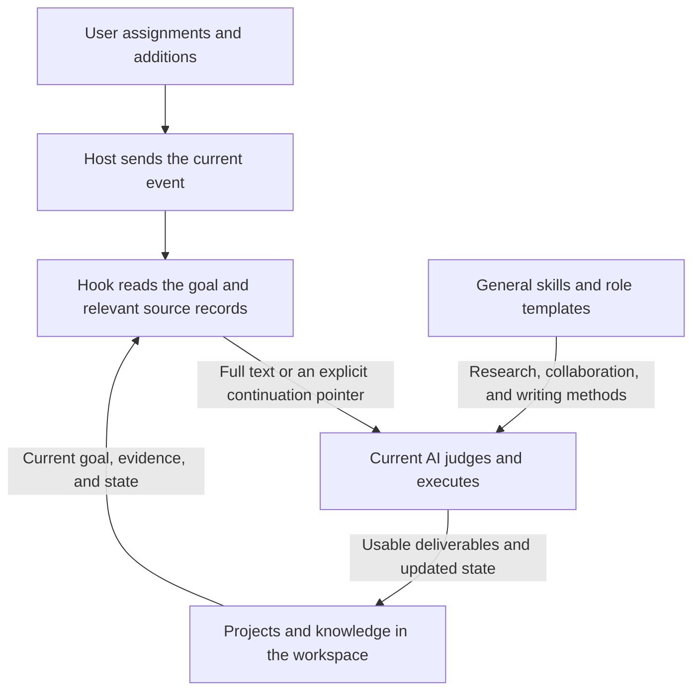

# Skills, host adapters, and runtime support

[English home](../../README.md) · [中文](../skills-and-hosts.md)

The public materials let a host AI continue from the same project, task, and knowledge source records. Skills describe when to research, how to hand off work, and how to communicate. Hooks deliver needed materials into the current session. Core code handles reading, writing, recall, and versions. The host still supplies models, tools, and permissions.



Seven independently authored skills retain their full text and author-owned references: `evidence-research`, `knowledge-docs`, `knowledge-recall`, `prompt-writing`, `task-openai-guidance`, `outcome-collaboration`, and `plain-writing`. They can be adopted in hosts with actual capabilities such as file reading/writing and search. Commands in these materials run from the repository root. Users create their own knowledge, experience, objects, account information, and project content in the workspace; the repository does not include the original author's data. English instruction copies are in [i18n/en/skills](../../i18n/en/skills/).

Thirteen `task-*` directories retain local additions and replacement text for OpenAI's original skills: Google Docs/Drive/Sheets/Slides, Drive comments, Pages writing, PDF, Presentations, Spreadsheets, Template Creator, Computer Use, Visualize, and Skill Installer. Each directory's `UPSTREAM.md` identifies the corresponding installed upstream version and the third-party parts omitted here. These directories contain actual amendment text and necessary reference changes, rather than complete original skill installation packages. Retain a lawfully obtained official original skill and add the local rules. Only locally authored additions fall under this repository's MIT license. OpenAI's original skills, runtimes, icons, and assets have not been reattributed or relicensed.

Third-party system skills and the original installer implementation are not bundled; the installer's local environment rules are retained separately. The locally installed original installer carries Apache 2.0 and should be obtained through the official installation route. Current official plugin examples and build entry points are [OpenAI Plugins](https://github.com/openai/plugins) and [Build plugins](https://developers.openai.com/codex/plugins/build-plugins). Skills bundled with an application may require its dedicated interfaces. Public examples do not establish that every original skill can be installed independently.

| Public directory | Implementation and conditions |
| --- | --- |
| `integrations/context/` | Six entry points share the `src/` core. The complete recall implementation and source for navigation, object attachment, resource candidates, task summaries, the failure inbox, task reporting, and precise maintenance are retained separately. |
| `integrations/hooks/` | Goal continuation, current project materials, knowledge and resource candidates, research packets, tool-failure hints, context budgets, and action controls. Input is host-event JSON; output follows the corresponding event contract. |
| `integrations/prompts/` | Actual generalized text of `project-state` and `compact`, covering project assignment, branches, goal updates, and continuation. English counterparts are in [i18n/en/integrations](../../i18n/en/integrations/). |
| `integrations/agents/` | Author-owned responsibility templates for Codex and Claude. Model, context, and quota parameters are original host options; adjust them to your actual environment. |
| `integrations/plugins/codex-swarm/` | Retains the author-owned plugin identity and skill, referencing the same `outcome-collaboration`; attribution uses the public GitHub account. |
| `integrations/pi/` | Two author-owned Pi extensions, code for discovering actual capabilities, and three legacy host skills. Pi must still support the original tool and model contracts; historical rules are explicitly marked. |
| `tools/local-html-preview.mjs` | Read-only localhost snapshot preview for one self-contained HTML file. Serves only the selected file and provides timed exit plus `stop`/`status`. |
| `tools/python-support/` | PyMuPDF/PyYAML dependency declarations and instructions for rebuilding an independent environment; Python and virtual environments were not copied. |
| `tools/model-clients/` | The original installation contained external SDK dependencies only, with no user-authored client. The directory explains this inventory result; `node_modules` was not copied. |

Run from the repository root with Node.js 24 or a compatible version supporting `node:sqlite`. Core entry points, hooks, and modules share `AI_WORK_HOME`, defaulting to the repository's `workspace/`. Set an explicit absolute path when launching from different current directories. `AI_CODEX_HOME` can override the host source location and defaults to `integrations/`. State and recipient lists are saved in the workspace's `integrations/`; core bindings share `workspace/bindings/`. Local preview state lives in the workspace's `.cache/previews/`, overridable with `AI_PREVIEW_HOME`. Use `AI_PYTHON` for the Python executable used by additional maintenance operations. If you use the full system's `AI_WORK_DATA_HOME` override, keep it on the same data root as `AI_WORK_HOME` so different entry points do not write to different workspaces.

```powershell
$env:AI_WORK_HOME = 'D:/ai-work-data'
node integrations/context/local-navigation.mjs list
node integrations/context/project-context.mjs read --project 'D:/ai-work-data/projects/example' --branch example-branch --compact
node integrations/context/recall.mjs search --query 'the current object and actual problem'
node tools/local-html-preview.mjs start --file 'D:/artifacts/example.html'
```

Reading source records requires your own projects and data. The object entry point forwards to `modules/system/资料中心/object-knowledge/objects.mjs`. Extended registry operations forward to the resource-center source, and task windows and context management forward to the task-collaboration modules. `methods.mjs` is an optional method-library attachment entry point. Explicitly set `AI_METHODS_ENTRY` to your own method-library module; it does not contain the original author's private method cards.

## Choose the appropriate data interface

The independent core and full-system resource services have specific format differences. `src/object-access.mjs` uses `objects.json` at the workspace root, and `src/resources.mjs` uses root-level `resources.json`. These are the independent interfaces from the first public core release. The full-system object entry point, `integrations/context/objects.mjs`, uses object source records under `workspace/system/资料中心/object-knowledge/data/`. The complete resource entry point, `integrations/context/resources.mjs`, shares `workspace/system/资料中心/data/资料登记.json` with the resource-center registry, using format `ai-resource-registry-v1`. Do not treat the independent JSON files with similar names as an initialized full library, or let two interfaces modify source records with incompatible formats. For complete object relationships, versions, and resource candidates, use the integrations entry points and the resource center's current library-creation methods. The independent core can be used on its own.

`integrations/context/recall.mjs` retains the complete recall implementation in use. It reads the complete object records and resource registry above, `workspace/system/信息中心/data/information.sqlite`, knowledge and deliverables, and `workspace/failure-inbox`. Current hooks reference this implementation; its index is saved in `.cache/recall-system/`. `src/recall.mjs` retains the independent core interface and uses `.cache/recall/`. Both share the workspace root while indexing their own source records. Choose entry points according to your needs; results from one index do not establish that the other library is connected. Ollama participates in semantic recall only when actually available. `AI_OLLAMA_EXECUTABLE` can specify your executable.

## Register hooks and explicit operating scopes

The host-event adapter input example is `integrations/hooks/adapter-input.example.json`. After filling in the actual absolute repository path, send it through standard input to `node integrations/hooks/intent-check.mjs`. This file describes JSON input; it is not host configuration that can overwrite an existing file unchanged. Register the command at an event supported by the current host according to that host version's official configuration contract. This release did not connect the source to new users' Codex, Claude, or Pi sessions.

Information notices have no enabled recipient scope by default: the empty example has no branch/session recipients. To use the feature, copy the `information-recipients` example to the workspace's `integrations/hooks/information-recipients.json` and fill in your own authorized real scope. Information-center code retains its module location; summaries, batches, and configuration are read from the workspace's `system/信息中心/{data,config}`. `informationNote.stateRoot` can explicitly override that location. Legacy cloud-package receipt runs only when explicitly enabled by current configuration. Missing configuration does not automatically restore a historical receipt mechanism.

Action controls use `workspace/integrations/context/action-boundaries.json`; start from the empty `rules` example to create precise rules of your own. Precise maintenance uses `workspace/config/maintenance.json`. Maintenance roots and historical retirement lists are all empty by default; the original author's deletion/modification lists are not reused. The maintenance implementation still requires specific paths, reasons, and recovery packages. It does not automatically delete files because they are old.

English templates and continuation instructions use the same source interfaces. Keep Chinese filenames, persisted shared-state headings and fields, configuration keys, and host identities compatible with the original protocol. English content and explanations do not imply that all runtime output or host UI is translated.

This work extracted source, adapted public paths, distinguished provenance, and saved documentation. It added no tests, benchmarks, acceptance stages, or persistent tasks. Users must connect external accounts, official runtimes, actual network calls, model availability, and continuous operation in their own environments. An inventory of files does not establish those connections.
