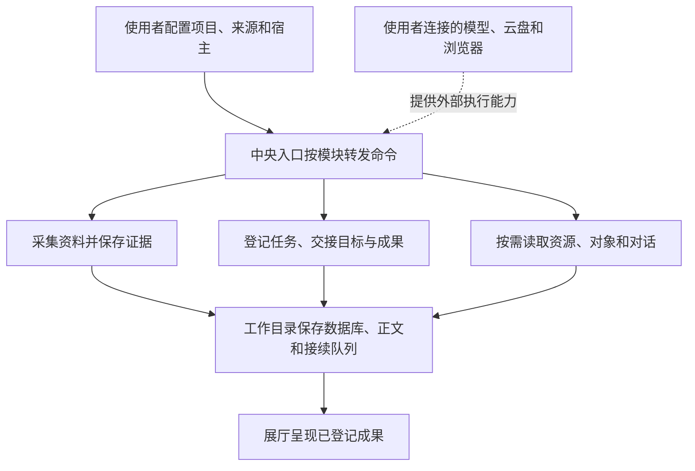

# 通用系统源码与运行入口

`modules/system` 保存从现用 AI 工作系统提取的通用实现：信息采集和接续、任务交接、资源与对象知识、本地对话导航、存储归档、成果展示，以及需要宿主浏览器的只读接入。公开版重新组织路径和配置，保留来源子目录，方便沿入口读到实现。发布包含源码与配置示例；本次提取没有启动服务、调用账号、注册日程或运行测试，因此源码存在不能用来证明这些功能已经在使用者的电脑或云端运行。



| 目录 | 主要源码入口 | 保存或返回什么 |
| --- | --- | --- |
| 运行中心 | `system.mjs`、`module-registry.mjs`、`event-ingest.mjs`、`event-dispatch.mjs`、`event-pipeline.mjs` | 模块目录、运行观察、事件队列、执行产物和失败；保留显式路由、租约与恢复实现 |
| 信息中心 | `app/main.py`、`app/task_collection.py`、`app/processor.py`、`app/publisher.py` | 来源采集、原文、任务驱动检索、分析队列和报告；模型分析需要使用者提供可调用的 Codex |
| 信息中心/cloud、接续接入 | `cloud/run_collect.py`、`cloud/run_native.py`、`接续接入/cloud-recovery.py`、`native-receive.py` | 单次云采集批次、分块和持久接续；远端托管和本地接收由使用者配置 |
| 任务协作 | `handoff-files.mjs`、`task-bridge.mjs`、`task-window.mjs`、`context-manager/context-manager.mjs` | 完整目标、当前分支、协作观察、任务认领和上下文融合；调用 `integrations/context`、`integrations/hooks` 中的自有宿主代码 |
| 资料中心 | `registry.mjs`、`handler.mjs`、`project-map.mjs`、`object-knowledge/objects.mjs` | 账号和权益引用、资源原件、项目结构、对象属性及证据；公开版没有本人登记数据 |
| 本地统一 | `workspace.mjs`、`对话记录/conversations.mjs`、`运行环境/runtime.mjs` | 对话原件的按需读取、真实更新时间和环境导航；读取范围依赖使用者设置的宿主路径 |
| 本地统一/对话记录/action-manager、original-manager | `action-manager.mjs`、`project-registry.mjs`、`app-client.mjs` | 项目目录和宿主原生界面接入；需要实际可用的 Codex app-server/桥接能力 |
| 存储接入、本地统一/文件归档 | `storage.py`、`cold_archive.py`、`google-drive.mjs`、`storage-health.mjs`、`lifecycle.py` | 显式文件快照、云盘工具计划、精确冷归档、磁盘观察；默认没有清理授权名单或云盘账号 |
| 成果展厅 | `showcase.mjs`、`web/`、`screenshot.mjs` | 已登记成果的全文、图片和网页；截图脚本需要使用者安装的 Edge/Chrome |
| 浏览器接入 | `boss-access.mjs`、`account-browser-access.mjs` | 注入宿主浏览器 API 后进行页面准备、只读观察和安全验证诊断；没有浏览器后端、Cookie 或登录数据 |
| 工具接入/community-tools/src | `cli.mjs`、`bili-local.py`、`restore.ps1` | 来源目录中的社区工具包装；依赖复用仓库 `plugins/community-tools` 的安装位置 |

中央搜索入口转发到 `modules/search-integrations`，公共检索和社区工具分别在 `plugins/search-tools`、`plugins/community-tools`。这里没有再次复制第三方依赖包。

## 配置自己的工作目录

Node.js 需要支持 `node:sqlite` 的版本，模块包声明为 Node.js 22.13 或更高。Python 源码使用 SQLite、标准库及信息中心的 `lxml` 依赖。Windows 日程和进程观察需要 PowerShell 7；其他平台可以复用通用 Node/Python 模块，Windows 专用入口需要自行接入替代宿主。

在仓库根目录设置工作路径和自己的可执行程序，再初始化配置。下列示例的 `D:/AI-Work` 是使用者选择的数据目录。

```powershell
$env:AI_WORK_HOME = 'D:/AI-Work'
$env:AI_PYTHON_PATH = 'D:/Python/python.exe'
$env:AI_PWSH_PATH = 'pwsh'
$env:AI_CODEX_EXECUTABLE = 'codex'
$env:AI_INFORMATION_TRIAGE_MODEL = 'YOUR_AVAILABLE_MODEL_ID'
$env:AI_INFORMATION_RESEARCH_MODEL = 'YOUR_AVAILABLE_MODEL_ID'
node modules/system/configure.mjs
npm install --prefix modules/system
& $env:AI_PYTHON_PATH -m pip install -r modules/system/信息中心/cloud/requirements.txt
```

`configure.mjs` 只新建缺失的配置文件和工作目录，已有文件会保留。它不登录、不调用模型、不创建开机任务或每日任务。随后在工作目录 `system/信息中心/config/settings.json`、`sources.json` 和 `collection.json` 填入自己的模型、公开来源与处理条件。初始来源列表为空，云接入和自动分析未启用。

| 设置 | 默认位置或用途 |
| --- | --- |
| `AI_WORK_HOME` / `AI_WORK_DATA_HOME` | 所有新增运行数据的根目录；后者优先；未设置时为仓库 `workspace` |
| `AI_WORK_SYSTEM_HOME` | 通用源码根目录；默认 `modules/system` |
| `AI_CODEX_HOME` | 自有宿主源码根目录；默认 `integrations`；宿主运行数据单独保存在工作目录 `integrations` |
| `AI_PROJECTS_HOME` | 使用者的项目目录；默认工作目录 `projects` |
| `AI_USER_HOME` | 需要读取现有本地对话或宿主配置时，显式设置用户目录；默认工作目录 `user` |
| `AI_RUNTIME_HOME` | 可选运行时包位置；默认工作目录 `runtime`；可执行程序也可由 `AI_PYTHON_PATH`、`AI_PWSH_PATH` 指定 |
| `AI_PLUGINS_HOME` | 默认仓库 `plugins` |
| `AI_DRIVE_FOLDER_ID` | 使用者自己的 Drive 文件夹 ID；公开版为空 |
| `AI_BROWSER_EXECUTABLE` | 截图脚本可选的 Edge/Chrome 可执行文件 |
| `AI_ARCHIVE_ALLOWED_ROOTS` / `AI_ARCHIVE_PROTECTED_ROOTS` | JSON 数组形式的归档范围与保护目录；默认空数组 |

信息中心保留 `ROOT` 指向源码，`DATA`、`REPORTS`、`LOGS`、`CONFIG` 分别在工作目录 `system/信息中心`；独立云采集使用 `system/信息中心/cloud`。这样宿主可运行 `modules/system/信息中心/app` 中的脚本，同时从工作目录读取配置、数据库和日志。项目目标、共享状态与成果登记由使用者在自己的项目目录维护，未随公开版复制。

## 从实际入口开始使用

```powershell
node modules/system/运行中心/system.mjs modules
node modules/system/运行中心/system.mjs help
node modules/system/运行中心/system.mjs module task-collection --help
node modules/system/运行中心/system.mjs module object-knowledge help
node modules/system/运行中心/system.mjs module goal-handoff help
node modules/system/运行中心/system.mjs module event-ingest help
node modules/system/运行中心/system.mjs module event-dispatch help
node modules/system/本地统一/workspace.mjs help
node modules/system/存储接入/google-drive.mjs help
```

中央入口保留各模块原参数，`modules` 只清点入口文件。资料中心和对象知识使用空示例登记作为起点。信息中心报告和任务数据库在配置后由对应命令创建。上下文融合需要使用者自己的 `核心.md`、`共享状态.md` 和规则原件；不存在这些材料时，模块会保留缺口，不替使用者编造目标。

成果展厅读取 `AI_PROJECTS_HOME` 下各项目 `成果/成果登记.json`，登记的成品路径需要落在其允许读取范围内。运行 `node modules/system/成果展厅/showcase.mjs help` 查看服务和展示参数；该服务默认仅监听本机地址。

BOSS 适配器是库接口。调用者需要从当前宿主取得实际浏览器对象，再用 `createBossAccess(browser, options)` 或 `createAccountBrowserAccess(browser, sitePolicies)` 创建访问器。页面准备、遇到安全验证、登录成功和稳定读取是不同状态。这里的源码不包含反验证措施，也没有接入使用者账号。

Drive 适配器可先生成 `prepare-store`、`download-plan` 等工具计划；实际上传和下载需注入已认证的 `callTool`，或在具备对应连接器的任务中执行计划。单独运行 CLI 不会继承 Codex 的 OAuth。Gemini 适配器需要使用者提供支持当前账号的原生 CLI，可用 `GEMINI_EXECUTOR_CLI` 指定；公开版不包含该程序、登录资料或账号权益。Codex 执行器需要可用的本机 Codex CLI。具体任务、参数、费用和模型可用性由使用者配置的服务决定。

Windows 的 `install-schedule.ps1`、`install-startup.ps1` 和 `boot*.ps1` 作为运行支持源码保留。安装仓库和初始化配置不会调用它们；需要持续运行时，应按自己的日程、进程和恢复条件显式配置。独立云采集脚本也需要真实托管环境、日程和批次回执，公开源码没有替使用者部署长期服务。

## 提取范围与许可

用户自有通用代码沿仓库 MIT 许可公开。这里依赖的 MCP SDK、lxml、Google CLI、Undici、Context7、OpenCLI、B站相关库和其他外部程序仍受各自原许可约束，安装依赖不会把第三方实现改成仓库作者所有。源码只保留包装和依赖声明，没有复制第三方安装目录、二进制或下载原证。

公开版排除了小说、训练和付费创作生产链、闲鱼托管与交易平台业务模块、市场数据中心、自主商品机会和销售制作链。中央目录、产品路由、业务周期调用和业务专用环境发现均已移除。源码中的一般长文展示功能仍用于展示任意文稿。

私人账号、邮箱、Cookie、凭据、真实数据库、完整对话、知识原件、生产配置、日志和运行回执未复制。原专用清理名单改为空配置，旧项目和窗口标识改为示例或删除。来源代码的逻辑路径见 `modules/system/source-index.json`，运行数据应由使用者初始化并按自己的需求录入。本次交付提供可复用源码与配置方法；没有声称全部外部宿主、账号或长期服务已经接通。
