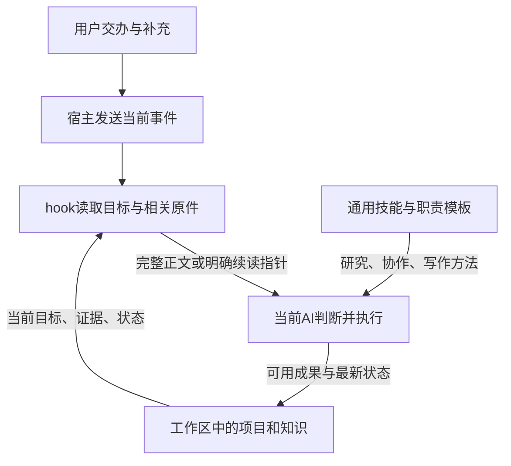

# 技能、宿主适配与运行支持

<!-- bilingual-navigation -->
简体中文 · [English](en/skills-and-hosts.md) · [中文首页](../README.zh-CN.md)

公开部分让宿主 AI 从同一套项目、任务与知识原件继续工作：技能说明何时研究、怎样交接和怎样表达，hook 负责把需要的材料送入当前会话，核心代码负责读写、召回和版本。宿主仍负责提供模型、工具和权限。



独立自写的七个技能保留完整正文及自有参考：evidence-research、knowledge-docs、knowledge-recall、prompt-writing、task-openai-guidance、outcome-collaboration、plain-writing。它们可以在具有文件读写、搜索等实际能力的宿主中采用，文中命令从仓库根运行。工作区里的知识、经验、对象、账号资料和项目内容由使用者自行建立，仓库不附带原作者的数据。

十三个 `task-*` 目录保留对 OpenAI 原技能的本地新增和替换文字：Google Docs/Drive/Sheets/Slides、Drive comments、Pages writing、PDF、Presentations、Spreadsheets、Template Creator、Computer Use、Visualize、Skill Installer。每个目录的 `UPSTREAM.md` 说明对应原安装版本与缺少的第三方部分。这些目录包含实际修订正文和必要参考改动，不是完整的原技能安装包；使用时保留依法取得的官方原技能，加入本地规则。只有本地新增内容适用仓库 MIT，未把 OpenAI 原技能、运行库、图标和资产改署名或重新许可。

第三方系统技能与原 installer 实现未打包，installer 的本地环境规则另行保留。原 installer 本地许可为 Apache 2.0，沿官方安装取得。当前官方插件示例和构建入口见 [OpenAI Plugins](https://github.com/openai/plugins) 与 [Build plugins](https://developers.openai.com/codex/plugins/build-plugins)。应用随附的技能可能需要其专用接口，不能因公开示例存在就声称每个原技能都可独立安装。

| 公开目录 | 实现与条件 |
| --- | --- |
| `integrations/context/` | 六个入口共用 `src/` 核心；完整召回实现及导航、对象挂载、资源候选、任务摘要、错误收件箱、任务回报和精确维护源码独立保留。 |
| `integrations/hooks/` | 目标接续、当前项目材料、知识与资源候选、研究资料包、工具失败提示、上下文预算及动作控制。输入为宿主事件 JSON，输出沿对应事件契约。 |
| `integrations/prompts/` | project-state 与 compact 的通用化实际正文，说明项目归属、分支、目标更新和接续。 |
| `integrations/agents/` | Codex 和 Claude 的自有职责模板。模型、上下文与额度参数是原宿主选项，应按使用者实际环境调整。 |
| `integrations/plugins/codex-swarm/` | 保留自有插件身份和 skill，引用同一份 outcome-collaboration；署名使用公开 GitHub 账号。 |
| `integrations/pi/` | 两个 Pi 自有扩展、实体能力发现代码及三个旧宿主技能。原工具与模型契约仍需 Pi 支持，历史规则明确标记。 |
| `tools/local-html-preview.mjs` | 单个自包含 HTML 的只读 localhost 快照预览，仅提供选定文件，具有超时退出与 stop/status。 |
| `tools/python-support/` | PyMuPDF/PyYAML 依赖声明与独立环境重建用法；未复制 Python 和虚拟环境。 |
| `tools/model-clients/` | 原安装只有外部 SDK 依赖，无用户自写客户端；目录说明这项清点结果，未复制 node_modules。 |

从仓库根使用 Node.js 24 或支持 `node:sqlite` 的对应版本。核心入口、hook 和模块共用 `AI_WORK_HOME`，未设置时使用仓库的 `workspace/`；在不同当前目录启动时显式设置绝对路径。`AI_CODEX_HOME` 可覆盖宿主源码入口，默认 `integrations/`。状态与接收名单存到工作区的 `integrations/`，核心绑定共用 `workspace/bindings/`。本地预览状态位于工作区 `.cache/previews/`，可用 `AI_PREVIEW_HOME` 覆盖；附加维护调用的 Python 可用 `AI_PYTHON` 指定。全系统支持 `AI_WORK_DATA_HOME` 细分覆写时，应与 `AI_WORK_HOME` 保持同一个数据根，以免不同入口落到不同工作区。

```powershell
$env:AI_WORK_HOME = 'D:/ai-work-data'
node integrations/context/local-navigation.mjs list
node integrations/context/project-context.mjs read --project 'D:/ai-work-data/projects/example' --branch example-branch --compact
node integrations/context/recall.mjs search --query '当前对象与实际问题'
node tools/local-html-preview.mjs start --file 'D:/artifacts/example.html'
```

原件阅读需要使用者自己的项目与数据。对象入口转到 `modules/system/资料中心/object-knowledge/objects.mjs`，扩展 registry 操作转到资料中心源码，任务窗和上下文管理转到任务协作模块。`methods.mjs` 是可选方法库挂载入口，需要显式设置 `AI_METHODS_ENTRY` 指向使用者的方法库模块；不包含原作者私人方法卡。

独立核心和全系统资料服务的格式有具体区别：`src/object-access.mjs` 使用工作区根的 `objects.json`，`src/resources.mjs` 使用根的 `resources.json`；它们是首批公开核心的独立接口。全系统对象入口 `integrations/context/objects.mjs` 使用 `workspace/system/资料中心/object-knowledge/data/` 下的对象原件，完整资料入口 `integrations/context/resources.mjs` 与资料中心 registry 共用 `workspace/system/资料中心/data/资料登记.json`，格式为 `ai-resource-registry-v1`。不要把同名独立 JSON 当成完整库的初始化结果，也不要让两个接口同时修改格式不同的原件。需要完整对象关系、版本和资料候选时使用 integrations 的入口并沿资料中心现行建库方法；独立核心可以单独使用。

`integrations/context/recall.mjs` 保留现用完整召回：读取上述完整对象、资料登记、`workspace/system/信息中心/data/information.sqlite`、知识与成果，以及 `workspace/failure-inbox`。当前 hooks 引用这份实现，索引保存在 `.cache/recall-system/`。`src/recall.mjs` 保留独立核心接口，使用 `.cache/recall/`。两者共用工作区根但分别索引各自原件；使用者按需要选择入口，不把一个索引的结果说成另一套库已接入。Ollama 仅在实际可用时参与语义召回，`AI_OLLAMA_EXECUTABLE` 可以指定自己的可执行程序。

宿主事件适配的输入示例在 `integrations/hooks/adapter-input.example.json`。填入实际仓库绝对路径后可以通过标准输入交给 `node integrations/hooks/intent-check.mjs`。该文件描述 JSON 输入，不是可原样覆盖的宿主配置；将命令注册到当前宿主支持的事件位置，按该宿主版本的正式配置契约处理。源码未在本次接入新用户的 Codex、Claude 或 Pi 会话。

信息提示默认关闭接收范围：空示例没有 branch/session 接收者。需要该功能时，将 information-recipients 示例复制到工作区 `integrations/hooks/information-recipients.json` 并填写自己授权的真实范围。信息中心代码保留模块位置，摘要、批次与配置从工作区 `system/信息中心/{data,config}` 读取；`informationNote.stateRoot` 可显式覆盖。旧云接包只有当前配置明确启用时才执行，缺配置不会自动恢复历史收包机制。

动作控制使用 `workspace/integrations/context/action-boundaries.json`，从空 `rules` 示例建立自己的精确规则。精确维护使用 `workspace/config/maintenance.json`，维护根和历史退役清单默认全为空，不沿用原作者电脑上的删改名单。维护实现仍要求具体路径、理由和恢复包，不会因文件老旧自动删除。

这次完成源码提取、公共路径适配、来源区分与说明保存；未新增测试、跑分、验收或常驻任务。外部账号连接、官方运行库、真实网络调用、模型可用性与持续运行须由使用者在自己的环境中接入，不能由文件清点推定已经接通。
